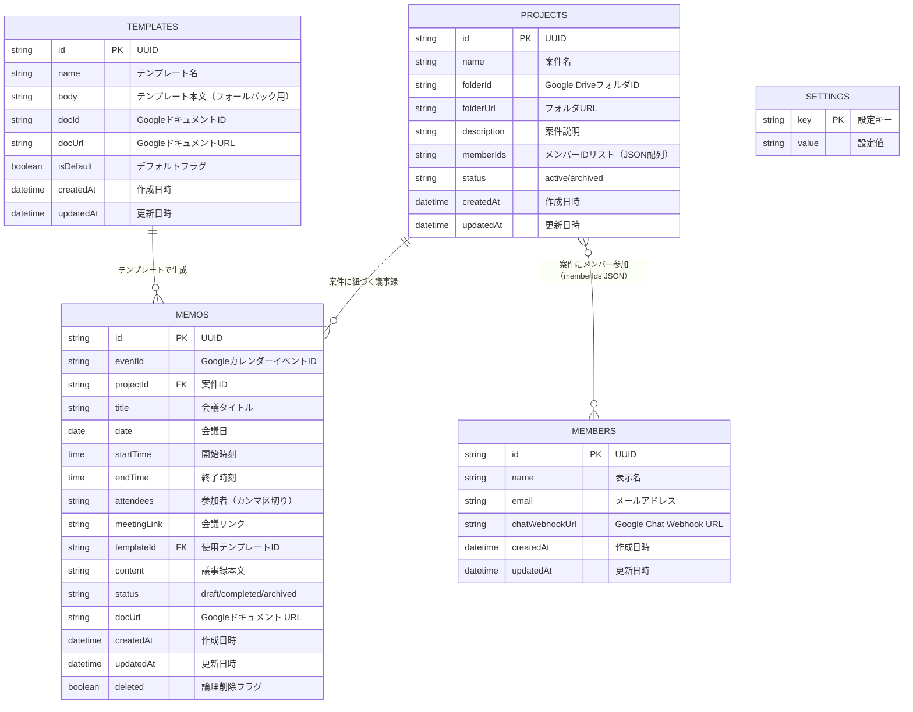

# ER図 - 議事録管理アプリ（改修後）

## Mermaid ER Diagram

## シート定義詳細

### 議事録シート（変更点）
| カラム | 新規/変更 | 説明 |
|--------|-----------|------|
| projectId | **新規追加** | 案件IDとの紐付け |
| docUrl | **新規追加** | 自動生成されたGoogleドキュメントのURL |

### テンプレートシート（変更点）
| カラム | 新規/変更 | 説明 |
|--------|-----------|------|
| docId | **新規追加** | GoogleドキュメントのファイルID |
| docUrl | **新規追加** | GoogleドキュメントのURL |
| body | 既存維持 | GDoc未登録時のフォールバック |

### 案件シート（新規）
| カラム | 型 | 説明 |
|--------|-----|------|
| id | string | UUID |
| name | string | 案件名 |
| folderId | string | Google DriveフォルダID |
| folderUrl | string | フォルダURL（表示用） |
| description | string | 案件説明 |
| memberIds | string | メンバーIDリスト（JSON配列） |
| status | string | active / archived |
| createdAt | datetime | 作成日時 |
| updatedAt | datetime | 更新日時 |

### メンバーシート（新規）
| カラム | 型 | 説明 |
|--------|-----|------|
| id | string | UUID |
| name | string | 表示名 |
| email | string | メールアドレス |
| chatWebhookUrl | string | Google Chat Webhook URL |
| createdAt | datetime | 作成日時 |
| updatedAt | datetime | 更新日時 |

### 設定シート（追加キー）
| キー | 説明 |
|------|------|
| triggerHour | トリガー実行時刻（既存） |
| targetCalendarIds | 対象カレンダーID（既存） |
| defaultTemplateId | デフォルトテンプレートID（既存） |
| baseFolderId | **新規**: データ格納先フォルダID |
| baseFolderUrl | **新規**: データ格納先フォルダURL |
