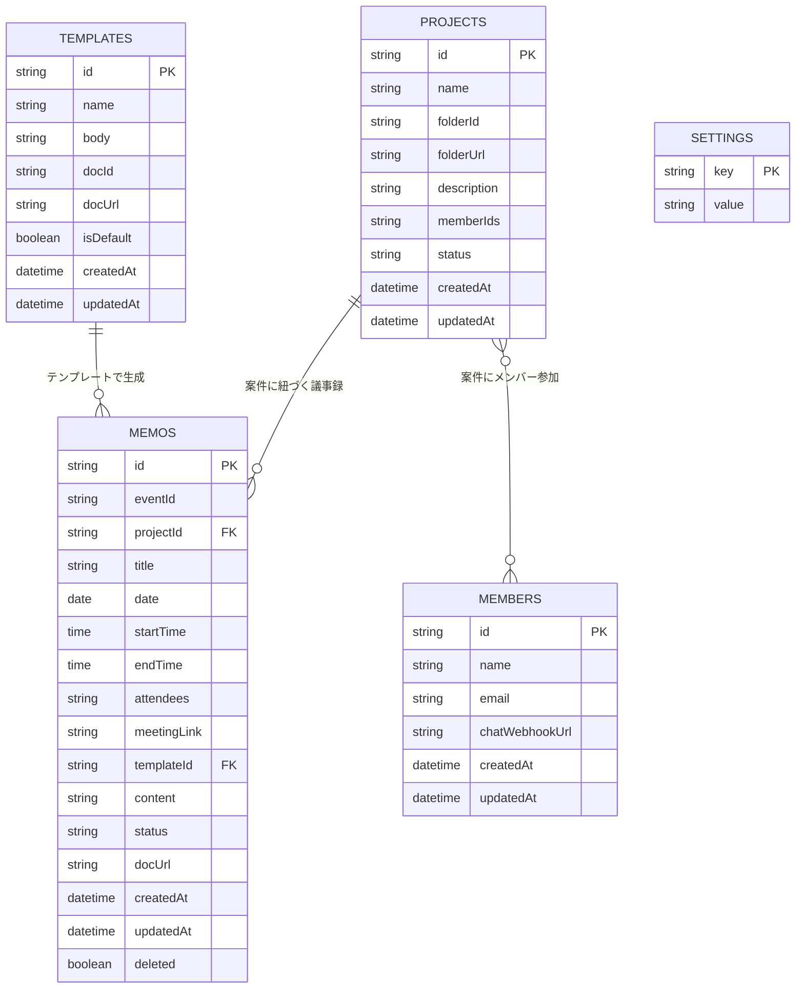

# 外部設計書 - 議事録管理アプリ

## 1. システム概要

### 1.1 目的
Google Workspace環境において、会議の議事録を効率的に作成・管理・配布するためのWebアプリケーション。
Googleカレンダーと連携し、会議イベントから自動的に議事メモを生成する機能を中心に据える。

### 1.2 対象ユーザー
- Google Workspaceまたは個人Googleアカウントを持つユーザー
- 複数の案件・プロジェクトにまたがる会議を日常的に行うビジネスユーザー

### 1.3 動作環境
| 項目 | 仕様 |
|------|------|
| プラットフォーム | Google Apps Script (Webアプリ) |
| 対応ブラウザ | Chrome, Edge, Firefox, Safari (最新版) |
| モバイル対応 | レスポンシブデザイン（スマートフォン・タブレット対応） |
| 認証 | Googleアカウント認証（OAuth 2.0） |

### 1.4 必要なGoogleサービス権限（OAuthスコープ）
| スコープ | 用途 |
|----------|------|
| spreadsheets | データの永続化（スプレッドシートDB） |
| drive | フォルダ・ファイルの作成・管理 |
| calendar.readonly | カレンダーイベントの読み取り |
| documents | Googleドキュメントの作成・読み取り |
| gmail.send | 議事録のメール配布 |
| script.scriptapp | 時間主導型トリガーの管理 |

---

## 2. 機能一覧

### 2.1 機能マップ

```
議事録管理アプリ
├── 初期セットアップ
│   ├── フォルダ選択/自動作成
│   └── スプレッドシート自動プロビジョニング
├── 議事録管理
│   ├── 議事録一覧（フィルタ・検索）
│   ├── 議事録作成・編集
│   ├── カレンダー連携自動生成
│   ├── Googleドキュメント生成
│   ├── 議事録配布（Gmail / Google Chat）
│   └── 一括操作（ステータス変更・削除）
├── 案件管理
│   ├── 案件CRUD
│   ├── 案件フォルダ自動作成
│   └── メンバー割り当て
├── メンバー管理
│   ├── メンバーCRUD
│   ├── メールアドレス管理
│   └── Google Chat Webhook管理
├── テンプレート管理
│   ├── テンプレートCRUD
│   ├── Googleドキュメント連携
│   ├── プレースホルダー
│   └── デフォルトテンプレート設定
└── 設定
    ├── 自動生成トリガー（時間指定）
    ├── 対象カレンダー選択
    ├── デフォルトテンプレート
    └── データリセット
```

### 2.2 機能詳細

#### F-001: 初期セットアップ
| 項目 | 内容 |
|------|------|
| 機能名 | 初期セットアップ |
| 概要 | 初回アクセス時にデータ保存用のスプレッドシートとフォルダを自動作成する |
| トリガー | 未セットアップ状態でアプリにアクセス |
| 入力 | 保存先フォルダ（任意指定 / 自動作成） |
| 処理 | フォルダ作成 → スプレッドシート作成 → シート初期化 → デフォルトデータ投入 |
| 出力 | セットアップ完了メッセージ、メイン画面への遷移 |

#### F-002: 議事録一覧・フィルタ
| 項目 | 内容 |
|------|------|
| 機能名 | 議事録一覧表示 |
| 概要 | 登録済みの議事録をテーブル形式で一覧表示する |
| フィルタ条件 | ステータス（下書き/完了/アーカイブ）、案件、日付範囲、テキスト検索 |
| 一括操作 | チェックボックス選択 → ステータス一括変更 / 一括削除 |
| インライン編集 | タイトルのダブルクリック編集 |

#### F-003: 議事録作成・編集
| 項目 | 内容 |
|------|------|
| 機能名 | 議事録作成・編集 |
| 概要 | 議事録の新規作成と既存議事録の編集を行う |
| 入力項目 | タイトル、案件、日付、開始/終了時刻、参加者、会議リンク、ステータス、テンプレート、本文 |
| 関連機能 | テンプレート適用、Googleドキュメント生成 |

#### F-004: カレンダー連携
| 項目 | 内容 |
|------|------|
| 機能名 | カレンダーからの議事メモ生成 |
| 概要 | Googleカレンダーのイベント情報を取得し、テンプレートを適用して議事メモを自動生成する |
| 手動実行 | 対象日・案件を指定して生成 |
| 自動実行 | 時間主導型トリガーで毎日指定時刻に当日分を自動生成 |
| 重複制御 | 同一イベントIDの議事メモが存在する場合はスキップ |
| 案件連携 | 案件指定時はGoogleドキュメントも自動作成 |

#### F-005: 議事録配布
| 項目 | 内容 |
|------|------|
| 機能名 | 議事録配布 |
| 概要 | 作成済み議事録を登録メンバーにメールまたはGoogle Chatで配布する |
| メール配布 | GmailApp経由でメンバーのメールアドレスに送信 |
| Chat配布 | UrlFetchApp経由でWebhook URLにHTTP POSTで送信 |
| メッセージ形式 | メール: プレーンテキスト本文、Chat: 500文字要約+ドキュメントリンク |

#### F-006: 案件管理
| 項目 | 内容 |
|------|------|
| 機能名 | 案件管理 |
| 概要 | 議事録を案件（プロジェクト）単位で整理・管理する |
| CRUD | 新規作成・編集・削除 |
| フォルダ自動作成 | 案件作成時にベースフォルダ内にサブフォルダを自動作成 |
| メンバー割り当て | 案件に参加するメンバーをチェックボックスで割り当て |
| ステータス | 進行中 / アーカイブ |

#### F-007: メンバー管理
| 項目 | 内容 |
|------|------|
| 機能名 | メンバー管理 |
| 概要 | 議事録の共有先となるメンバー情報を管理する |
| 登録情報 | 名前、メールアドレス、Google Chat Webhook URL |
| 利用箇所 | 案件のメンバー割り当て、議事録配布の宛先選択 |

#### F-008: テンプレート管理
| 項目 | 内容 |
|------|------|
| 機能名 | テンプレート管理 |
| 概要 | 議事録生成時に適用するテンプレートを管理する |
| テンプレートソース | Googleドキュメント連携（優先） / テキスト直接入力（フォールバック） |
| プレースホルダー | `{{会議タイトル}}` `{{日付}}` `{{開始時刻}}` `{{終了時刻}}` `{{参加者}}` `{{会議リンク}}` `{{説明}}` |
| デフォルト設定 | isDefaultフラグまたは設定画面から指定 |

#### F-009: 設定
| 項目 | 内容 |
|------|------|
| 機能名 | アプリ設定 |
| 設定項目 | 自動生成実行時刻、対象カレンダー、デフォルトテンプレート |
| トリガー管理 | 設定/解除ボタンで時間主導型トリガーを制御 |
| データリセット | プロパティ情報のクリア（スプレッドシート自体は残存） |

---

## 3. 画面設計

### 3.1 画面遷移図

```
[初回セットアップ画面]
    │
    ▼ セットアップ完了
[メインレイアウト]
    ├── サイドバーナビゲーション
    │   ├── メイン
    │   │   ├── [議事録一覧] ←→ [議事録編集]
    │   │   └── [案件管理]
    │   └── 管理
    │       ├── [メンバー管理]
    │       ├── [テンプレート管理]
    │       └── [設定]
    │
    └── モーダルダイアログ
        ├── カレンダー取得
        ├── 議事録配布
        ├── 削除確認（議事録/案件/メンバー/テンプレート）
        └── リセット確認
```

### 3.2 画面一覧

| 画面ID | 画面名 | ファイル | 説明 |
|--------|--------|----------|------|
| SCR-001 | 初回セットアップ | index.html | フォルダ選択 → セットアップ実行 |
| SCR-002 | 議事録一覧 | page-memos.html | フィルタ付き一覧テーブル、一括操作 |
| SCR-003 | 議事録編集 | page-memo-edit.html | フォーム形式の編集画面 |
| SCR-004 | 案件管理 | page-projects.html | 2カラムレイアウト（一覧+編集） |
| SCR-005 | メンバー管理 | page-members.html | 2カラムレイアウト（一覧+編集） |
| SCR-006 | テンプレート管理 | page-templates.html | 2カラムレイアウト（一覧+編集）、プレビュー機能 |
| SCR-007 | 設定 | page-settings.html | 各種設定フォーム |

### 3.3 画面詳細

#### SCR-001: 初回セットアップ画面
- **表示条件**: セットアップ未完了時
- **要素**:
  - アプリ名・説明テキスト
  - 保存先フォルダ選択ドロップダウン（マイドライブ直下のフォルダ一覧）
  - 「フォルダ一覧を更新」リンク
  - 「セットアップ開始」ボタン（実行中はスピナー表示）

#### SCR-002: 議事録一覧画面
- **アクションバー**:
  - 「新規作成」「カレンダーから取得」「更新」ボタン
  - 一括操作ボタン（選択時のみ表示）
  - フィルタ: 案件、ステータス、日付範囲、テキスト検索
- **一覧テーブル**:
  - カラム: チェックボックス、タイトル、案件、日付、時間、ステータス、操作
  - タイトルのダブルクリックでインライン編集
  - ステータスのドロップダウンで即時変更
  - 操作: 編集、配布、削除

#### SCR-003: 議事録編集画面
- **入力フィールド**: タイトル、案件、日付、開始/終了時刻、参加者、会議リンク、ステータス、テンプレート、Googleドキュメントリンク/作成ボタン、本文（textarea）
- **操作**: 保存、キャンセル

#### SCR-004: 案件管理画面
- **左カラム（一覧）**: 案件カードリスト（案件名、説明、ステータスバッジ、メンバー数）
- **右カラム（編集）**: 案件名、説明、ステータス、Driveフォルダリンク、メンバー割り当て（チェックボックス）

#### SCR-005: メンバー管理画面
- **左カラム（一覧）**: アバター付きメンバーリスト（名前、メール、Chat連携済チップ）
- **右カラム（編集）**: 名前、メールアドレス、Google Chat Webhook URL

#### SCR-006: テンプレート管理画面
- **左カラム（一覧）**: テンプレート名、デフォルトマーク、GDocチップ
- **右カラム（編集）**: テンプレート名、デフォルトフラグ、GoogleドキュメントURL入力、テキスト編集/プレビュータブ

#### SCR-007: 設定画面
- **メインカラム**: 自動生成トリガー（時刻選択・設定/解除）、対象カレンダー（チェックボックス一覧）、デフォルトテンプレート、データ保存先フォルダリンク、設定保存ボタン
- **サブカラム**: データリセットカード（警告色）

---

## 4. データモデル

### 4.1 エンティティ関連図



### 4.2 エンティティ定義

#### 議事録（MEMOS）
| カラム | 型 | 必須 | 説明 |
|--------|-----|------|------|
| id | string | ○ | UUID（主キー） |
| eventId | string | | GoogleカレンダーイベントID |
| projectId | string | | 案件ID（FK） |
| title | string | | 会議タイトル |
| date | string | | 会議日（YYYY-MM-DD） |
| startTime | string | | 開始時刻（HH:mm） |
| endTime | string | | 終了時刻（HH:mm） |
| attendees | string | | 参加者（カンマ区切り） |
| meetingLink | string | | 会議URL |
| templateId | string | | 使用テンプレートID（FK） |
| content | string | | 議事録本文 |
| status | string | ○ | draft / completed / archived |
| docUrl | string | | GoogleドキュメントURL |
| createdAt | string | ○ | 作成日時（ISO 8601） |
| updatedAt | string | ○ | 更新日時（ISO 8601） |
| deleted | boolean | ○ | 論理削除フラグ |

#### テンプレート（TEMPLATES）
| カラム | 型 | 必須 | 説明 |
|--------|-----|------|------|
| id | string | ○ | UUID（主キー） |
| name | string | ○ | テンプレート名 |
| body | string | | テンプレート本文（フォールバック用） |
| docId | string | | GoogleドキュメントID |
| docUrl | string | | GoogleドキュメントURL |
| isDefault | boolean | | デフォルトフラグ |
| createdAt | string | ○ | 作成日時 |
| updatedAt | string | ○ | 更新日時 |

#### 案件（PROJECTS）
| カラム | 型 | 必須 | 説明 |
|--------|-----|------|------|
| id | string | ○ | UUID（主キー） |
| name | string | ○ | 案件名 |
| folderId | string | | Google DriveフォルダID |
| folderUrl | string | | フォルダURL |
| description | string | | 案件説明 |
| memberIds | string | | メンバーIDリスト（JSON配列文字列） |
| status | string | ○ | active / archived |
| createdAt | string | ○ | 作成日時 |
| updatedAt | string | ○ | 更新日時 |

#### メンバー（MEMBERS）
| カラム | 型 | 必須 | 説明 |
|--------|-----|------|------|
| id | string | ○ | UUID（主キー） |
| name | string | | 表示名 |
| email | string | | メールアドレス |
| chatWebhookUrl | string | | Google Chat Webhook URL |
| createdAt | string | ○ | 作成日時 |
| updatedAt | string | ○ | 更新日時 |

#### 設定（SETTINGS）
| キー | 説明 | デフォルト値 |
|------|------|-------------|
| triggerHour | 自動生成実行時刻（0-23） | 7 |
| targetCalendarIds | 対象カレンダーIDリスト（JSON配列） | ["primary"] |
| defaultTemplateId | デフォルトテンプレートID | （空） |
| baseFolderId | データ保存先フォルダID | セットアップ時に設定 |
| baseFolderUrl | データ保存先フォルダURL | セットアップ時に設定 |

---

## 5. 外部インターフェース

### 5.1 Google APIとの連携

| サービス | 操作 | 用途 |
|----------|------|------|
| CalendarApp | getEvents, getCalendarById | カレンダーイベント取得 |
| SpreadsheetApp | openById, getRange, setValues | データCRUD |
| DriveApp | createFolder, getFolderById | フォルダ管理 |
| DocumentApp | create, openById, getBody | ドキュメント作成・テンプレート読込 |
| GmailApp | sendEmail | 議事録メール配布 |
| UrlFetchApp | fetch (POST) | Google Chat Webhook送信 |
| CacheService | get, put, remove | パフォーマンスキャッシュ |
| PropertiesService | getUserProperties | 設定値永続化 |
| ScriptApp | newTrigger, deleteTrigger | トリガー管理 |

### 5.2 Google Chat Webhook
- **プロトコル**: HTTPS POST
- **Content-Type**: application/json
- **ペイロード**: `{ "text": "<メッセージ本文>" }`
- **レスポンス**: HTTP 200で成功判定

---

## 6. 非機能要件

### 6.1 パフォーマンス
| 項目 | 仕様 |
|------|------|
| 初期表示 | doGet時にscriptletで初期データ埋め込み（API呼び出し不要） |
| データキャッシュ | CacheServiceによる5〜10分間のキャッシュ |
| GAS実行時間制限 | 1関数あたり最大6分 |

### 6.2 セキュリティ
| 項目 | 仕様 |
|------|------|
| 認証 | Googleアカウント認証（OAuth 2.0） |
| 実行権限 | USER_ACCESSING（アクセスユーザーの権限で実行） |
| データ分離 | UserProperties / UserCache によるユーザー単位のデータ分離 |
| サンドボックス | HtmlService.XFrameOptionsMode.ALLOWALL |

### 6.3 可用性
| 項目 | 仕様 |
|------|------|
| SLA | Google Apps Scriptプラットフォームに依存 |
| データ永続性 | Googleスプレッドシート（Google Drive上） |
| バックアップ | Google Driveの版管理による自動バックアップ |
